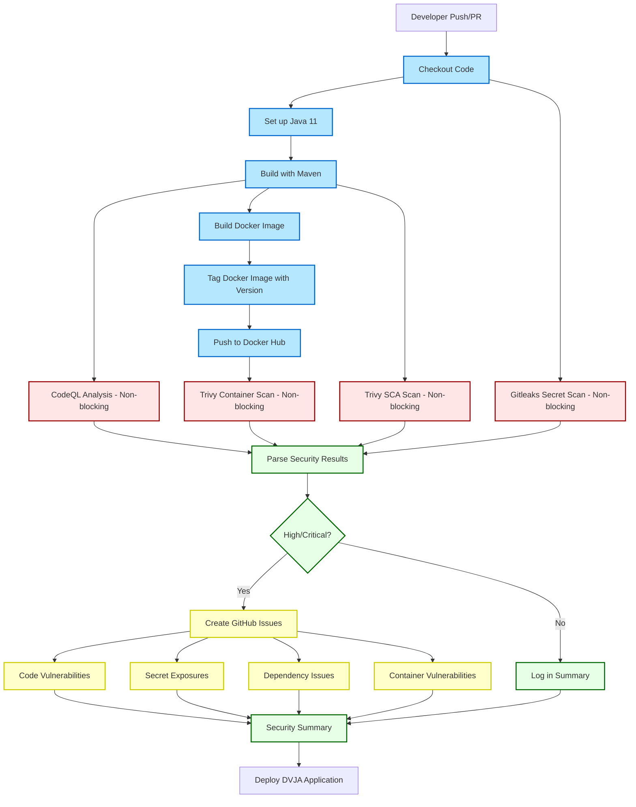

# DevSecOps Pipeline for DVJA

This project implements a comprehensive DevSecOps pipeline for the Damn Vulnerable Java Application.

## Pipeline Workflow

## Security Findings

The pipeline automatically scans for security issues and creates GitHub issues for any findings categorized as High or Critical.